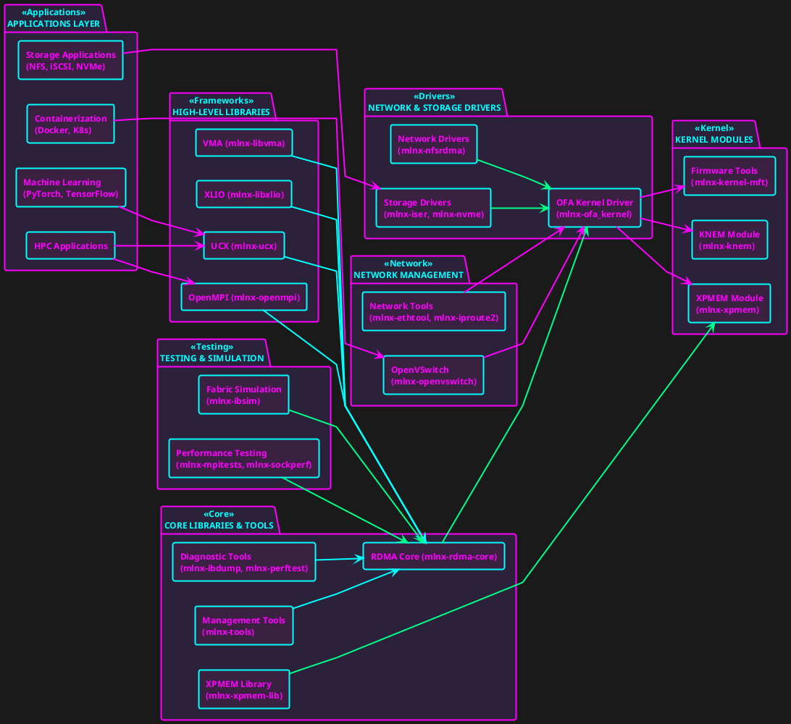
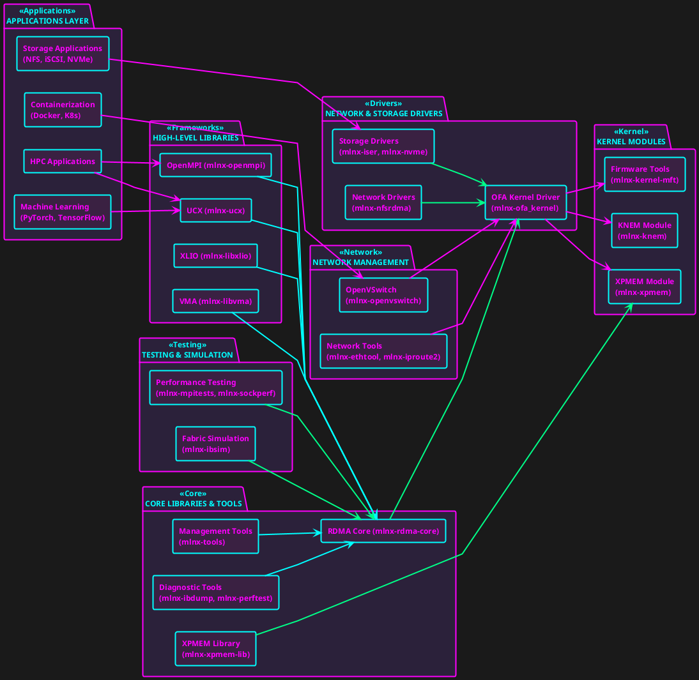

# MOFED AUR

Mellanox OpenFabrics Enterprise Distribution (OFED) packages for Arch Linux.
Part of an effort to bring first-class HPC support for Arch.



<!-- collapse -->
<details>
<summary></summary>



</details>

## Package List

| Package Name       | Version       | Description                                        |
|--------------------|---------------|----------------------------------------------------|
| mlnx-xpmem         | 2.7.4         | XPMEM (Cross-Partition Memory) Linux kernel module |
| mlnx-xpmem-lib     | 2.7           | XPMEM (Cross-Partition Memory) library             |
| mlnx-knem          | 1.1.4.90mlnx3 | High-Performance Intra-Node MPI Communication      |
| mlnx-rdma-core     | 2410mlnx54    | RDMA core userspace libraries and daemons          |
| mlnx-ofa_kernel    | 24.10         | Mellanox OpenFabrics Alliance kernel driver        |
| mlnx-kernel-mft    | 4.30.1        | Mellanox Firmware Tools kernel driver              |
| mlnx-fwctl         | 24.10         | Mellanox firmware control utility                  |
| mlnx-ibdump        | 6.0.0         | InfiniBand network sniffer                         |
| mlnx-ibsim         | 0.12          | InfiniBand fabric simulator                        |
| mlnx-ibarr         | 0.1.3         | InfiniBand Address Resolution Responder            |
| mlnx-tools         | 24.10         | Mellanox firmware management and diagnostic tools  |
| mlnx-steering-dump | 1.0.0         | Mellanox steering dump utility                     |
| mlnx-ethtool       | 6.9           | Mellanox-enhanced ethtool utility                  |
| mlnx-iproute2      | 6.10.0        | Mellanox-enhanced iproute2 utility                 |
| mlnx-perftest      | 24.10.0       | InfiniBand performance tests                       |
| mlnx-sockperf      | 3.10          | Network benchmarking utility                       |
| mlnx-ucx           | 1.18.0        | Unified Communication X library                    |
| mlnx-openmpi       | 4.1.7rc1      | High-performance message passing library           |
| mlnx-mpitests      | 3.2.24        | MPI benchmarks and tests                           |
| mlnx-libvma        | 9.8.60        | Mellanox Messaging Accelerator library             |
| mlnx-libxlio       | 3.40.2        | Mellanox Accelerated I/O library                   |
| mlnx-multiperf     | 3.0           | Network performance testing tool                   |
| mlnx-openvswitch   | 2.17.8        | Production quality, multilayer virtual switch      |
| mlnx-iser          | 24.10         | iSCSI Extension for RDMA (iSER) target driver      |
| mlnx-isert         | 24.10         | iSER target kernel module                          |
| mlnx-srp           | 24.10         | SCSI RDMA Protocol initiator driver                |
| mlnx-nfsrdma       | 24.10         | NFS over RDMA client driver                        |
| mlnx-nvme          | 24.10         | NVMe over Fabrics host driver                      |
| mlnx-rshim         | 2.1.8         | Remote System Health Information Module driver     |
| mlnx-ofed-scripts  | 24.10         | OpenFabrics Enterprise Distribution scripts        |
| mlnx-ofed-docs     | 24.10         | OpenFabrics Enterprise Distribution documentation  |

## Installation

To install all of these packages, clone this repository and navigate to the desired package directory. Then run:

```bash
make
```

or use `yay` to install each one individually, e.g.:

```bash
yay -S xpmem
```

## Disclaimer

These packages are unofficial and not directly supported by Mellanox. Use at your own risk.
